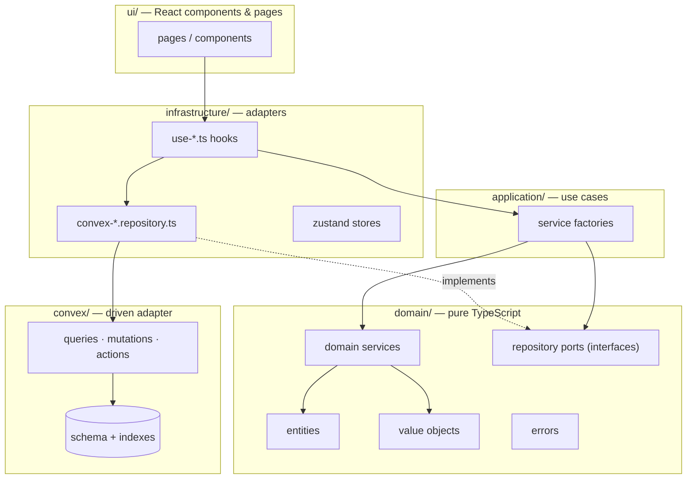
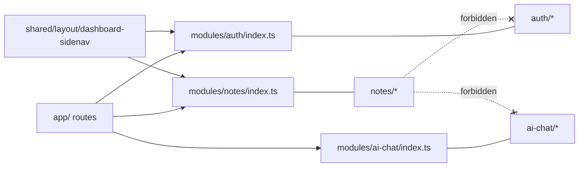

# Architecture

Inkwell is a **feature-modular hexagonal (ports & adapters)** application. This document explains how the code is organized, what the boundaries are, and how a request flows from a click in the UI to a row in Convex.

If you only remember three things from this page, remember these:

1. **The dependency rule** — `ui → application → domain ← infrastructure`. The `domain/` layer never imports React, Convex, Zustand, GSAP, or Lexical.
2. **Ports are hook-based** — a repository port is a TypeScript type describing the React hooks a feature needs. The infrastructure layer implements them by wrapping Convex's `useQuery` / `useMutation` / `useAction`.
3. **The UI never touches Convex directly** — UI code imports from a module's public API (`@/modules/<feature>`). The module wires Convex internally, so the same UI could be re-hosted on a different backend by swapping one adapter.

---

## The layered picture



Read the arrows as "depends on". Domain sits at the center and depends on nothing. Everything else depends on domain.

---

## The six feature modules

Each module lives under `src/modules/<name>/` and exposes a public API through `index.ts`. External code — including other modules and `app/` routes — may only import from that barrel.

| Module      | What it owns                                                    | Public API highlights                                                                 |
| ----------- | --------------------------------------------------------------- | ------------------------------------------------------------------------------------- |
| `notes`     | Note CRUD, filters, favorites, pin, archive, trash, autosave, editor | `useActiveNotes`, `useNote`, `useNoteActions`, `NoteEditor`, `NotesListPage`, ...     |
| `auth`      | Sign in / up / out, session, password reset, current user       | `AuthGuard`, `useAuthSession`, `useAuthActions`, `useCurrentUser`, `LoginPage`, ...   |
| `ai-chat`   | AI assistant panel, chat state, attached-note context, Writer mode | `AIChatButton`, `AIChatPanel`, `useAIChatStore`                                       |
| `folders`   | Folder CRUD, color, note-to-folder assignment                    | Folder hooks + UI components                                                          |
| `tags`      | Tag CRUD, note-to-tag relations                                  | Tag hooks + UI components                                                             |
| `settings`  | Profile update, account deletion, export flows                   | Settings pages + destructive-action UI                                                |

> **Heads up:** `CLAUDE.md` currently documents only the first three modules. The code has six. When they conflict, trust the code.

---

## Anatomy of a module

Every module follows the same shape:

```
src/modules/<feature>/
  domain/               # pure — zero framework imports
    entities/           # types backed by Doc<"...">
    value-objects/      # pure functions (e.g. generateSlug)
    services/           # pure transformations (filtering, prompts)
    repositories/       # PORT interfaces (hook signatures)
    errors/             # feature-specific error subclasses (if any)
  application/          # use cases as service files
    <feature>.service.ts
  infrastructure/       # adapters
    repositories/       # implement the port via Convex hooks
    hooks/              # wrap the service for UI consumption
    stores/             # Zustand (feature-local UI state, if any)
  ui/                   # presentation only — no business logic
    components/         # feature-specific components
    pages/              # <FeatureName>Page components
    schemas/            # Zod schemas for forms
  index.ts              # PUBLIC API — the only file other modules import from
```

### Walkthrough: how a note gets fetched

Follow `src/modules/notes/` from center to edge.

**1. Domain — the port** (`domain/repositories/note.repository.ts`)

The port is a plain TypeScript type describing the hook shape the feature needs:

```typescript
export type NoteRepositoryPort = {
  useList: () => { notes: Note[] | undefined; isLoading: boolean };
  useFavoriteList: () => { notes: Note[] | undefined; isLoading: boolean };
  useArchivedList: () => { notes: Note[] | undefined; isLoading: boolean };
  useDeletedList: () => { notes: Note[] | undefined; isLoading: boolean };
  useGet: (slug: string) => { note: Note | undefined; isLoading: boolean };
  useSearch: (search: string) => { notes: Note[] | undefined; isLoading: boolean };
  useMutations: () => NoteMutations;
};
```

Nothing here mentions Convex. The port is what the application depends on.

**2. Infrastructure — the Convex adapter** (`infrastructure/repositories/convex-note.repository.ts`)

The adapter implements the port by wrapping Convex hooks:

```typescript
export const convexNoteRepository: NoteRepositoryPort = {
  useList: () => {
    const notes = useQuery(api.notes.listNotes, {});
    return { notes: notes ?? undefined, isLoading: notes === undefined };
  },
  useGet: (slug: string) => {
    const note = useQuery(api.notes.getNoteBySlug, slug ? { slug } : "skip");
    return { note: note ?? undefined, isLoading: note === undefined };
  },
  useMutations: () => {
    const createMutation = useMutation(api.notes.createNote);
    // ...
    return {
      create: async (input) => { await createMutation(input); },
      // ...
    };
  },
};
```

This is the *only* place in the notes module that knows Convex exists.

**3. Application — the use cases** (`application/notes.service.ts`)

The service is a factory over the port:

```typescript
export function createNotesService(repo: NoteRepositoryPort) {
  return {
    useActiveNotes(search: string, sortOrder: SortOrder) {
      const { notes, isLoading } = repo.useList();
      const filtered = filterAndSort(notes, { search, sortOrder });
      return { notes: filtered, isLoading };
    },
    // ... more use cases
  };
}
```

`filterAndSort` is a pure domain service. The application layer composes port data with domain logic — no framework calls of its own.

**4. Composition root** (`infrastructure/notes-service.ts`)

One line wires the adapter into the service and re-exports typed hooks:

```typescript
export const notesService = createNotesService(convexNoteRepository);
```

**5. Public API** (`index.ts`)

The barrel exports hooks, page components, and types — nothing else:

```typescript
export { useActiveNotes, useNote, useNoteActions } from "./infrastructure/hooks/...";
export { NoteEditor, NotesListPage, /* ... */ } from "./ui/...";
export type { Note, NoteId, SortOrder } from "./domain/entities/note";
```

**6. UI consumption** (`ui/pages/notes-list-page.tsx`)

The page imports from the public API. It has no idea Convex is under the hood:

```typescript
import { useActiveNotes, useNoteActions } from "@/modules/notes";

const { notes, isLoading } = useActiveNotes(search, sortOrder);
const { archiveNote } = useNoteActions();
```

---

## Module boundaries



Rules the boundary enforces:

- **Cross-module imports go through `index.ts`.** `notes/ui/*` may not reach into `auth/domain/*`. Use `import { useCurrentUser } from "@/modules/auth"`.
- **`shared/` does not import from `modules/`.** The single sanctioned exception is `shared/layout/dashboard-sidenav/`, which is the dashboard composition root and needs the module APIs to render nav items.
- **`app/` is the outermost composition root.** Page files are thin re-exports; layouts wire modules together (see `app/(dashboard)/layout.tsx` for `<AuthGuard>` + `<DashboardSidenav>` + `<AIChatButton/Panel>`).
- **Only adapters import `convex/react`.** A grep confirms it: every `convex/react` import lives under `src/modules/*/infrastructure/repositories/` or in `src/shared/providers/convex-client-provider.tsx` (root provider setup).

---

## Cross-cutting concerns

**`src/core/errors/`** — the `AppError` base class plus `NotAuthenticatedError`, `NotAuthorizedError`, `NotFoundError`, and `mapConvexError(err)` / `toAppError(err)` helpers that translate raw Convex errors into typed app errors.

**`src/shared/ui/`** — design-system primitives (Button, Input, Dialog, Tooltip, Dropdown, …). No feature-specific logic ever lives here.

**`src/shared/providers/`** — `ConvexClientProvider` (constructs the `ConvexReactClient`) and `ErrorBoundary`. Wraps the entire tree in `app/layout.tsx`.

**`src/shared/layout/`** — `Header`, `Sidenav`, `DashboardSidenav`, plus landing-page composition pieces.

**`src/lib/lexical/`** — the *single source of truth* for the editor: `createEditorConfig`, `editorTheme`, `editorNodes`, `extractTextFromLexicalJSON`, `jsonToMarkdown`, `RestoreContentPlugin`, `FloatingFormatToolbarPlugin`, `EditorPluginsBundle`. Every mount of the editor — `NoteEditor`, `NoteDrawer`, `NoteDetailPage` — configures through this module so behavior stays consistent.

**`src/shared/hooks/`** — `use-toast`, `use-focus-trap`, `use-portal-mounted`.

---

## State management

Two different kinds of state, two different homes.

**Server state — Convex.** `useQuery` (wrapped inside each module's adapter) is the source of truth. There is no client-side cache duplication, no Redux store shadowing the server, no manual invalidation. Convex handles reactivity end-to-end.

**Client UI state — Zustand.** Two flavors:

- **Feature-local stores** live under `src/modules/<feature>/infrastructure/stores/`. Example: `ai-chat.store.ts` owns the panel open/close state, per-context chat message history, attached files, and a `pendingInsertion` payload the editor consumes when the assistant writes into a note.

  ```typescript
  type AIChatStore = {
    isOpen: boolean;
    currentContext: string;                       // "dashboard", "note-detail", ...
    contextMessages: Record<string, ChatMessage[]>;
    attachedNote: AttachedNote | null;
    attachedFiles: AttachedFile[];
    isLoading: boolean;
    pendingInsertion: PendingInsertion | null;
    // ... setters
  };
  ```

- **Cross-cutting stores** live under `src/shared/stores/`. Example: `toast.store.ts`, callable from anywhere via `useToastStore.getState()` — that's how the `toast.success(...)` / `toast.error(...)` façade works outside React components.

---

## Routing

App Router with three route groups:

| Group         | Layout wraps                                       | Purpose                         |
| ------------- | -------------------------------------------------- | ------------------------------- |
| `(auth)`      | Minimal auth chrome                                | Login, register, password flows |
| `(dashboard)` | `AuthGuard` + `DashboardSidenav` + `AIChatPanel`   | All protected pages             |
| `(root)`      | Header + Lenis smooth scroll                       | Public landing page             |

Page files are thin re-exports — they render a `<*Page />` component from the relevant module:

```typescript
// app/(dashboard)/dashboard/notes/page.tsx
import { NotesListPage } from "@/modules/notes";

export default function Page() {
  return <NotesListPage />;
}
```

The single documented exception is `app/(root)/page.tsx`: the landing page owns its own GSAP timeline inline because it isn't part of any feature module.

Dynamic routes use `[slug]`, not `[id]` — notes are addressed by slug (`/dashboard/notes/[slug]`).

---

## A note on drift

`CLAUDE.md` is the canonical internal guide, but a few statements have drifted from the code:

- It describes `src/core/types/Result<T, E>`. That directory doesn't exist. Error handling uses `try/catch` with `toAppError()` conversion, not `Result` types.
- It lists three modules (`notes`, `auth`, `ai-chat`). The tree has six.

When docs and code disagree, the code wins. If you spot other drift while contributing, open a PR against `CLAUDE.md` alongside your feature work.
